## Task 3: WEB UI Forms

### Overview

In Task 3, we aim to create a WEB UI frontend for the application developed in Task 1 using Flask Framework in Python. The frontend will allow users to interact with the application by performing CRUD operations (Create, Read, Update, Delete) on task records. 

### Project Structure

```
Flask Webapp
│
├── templates/
│   ├── assignee.html         # Main HTML file for the UI
│   ├── create.html           # HTML file for creating tasks
│   └── findall.html          # HTML file to display all tasks and searching by id
│   └── delete.html           # HTML file to delete task by id
│   └── index.html            # Main HTML file for the UI
│
├── crud.py                   # Python file to execute CRUD operations using flask
│── static/
│   └── style.css             # CSS file for styling the UI
└── README.md                 # Detailed instructions and documentation
```

### Components

1. **HTML Templates**: The `templates/` directory contains HTML files for different UI views, such as creating tasks, displaying tasks by assignee, finding all tasks, and deleting tasks.
2. **CSS Styling**: The `style.css` file is used to style the HTML elements and layout of the UI.
3. **Flask Backend**: The `crud.py` file contains Python code to handle CRUD operations using Flask routes and controllers.

### Functionality

- **Create Task**: Users can input task details in a form and submit it to create a new task record.
- **Show Tasks by Assignee**: Display tasks filtered by assignee.
- **Find All Tasks**: Display all existing task records and allow searching by task ID.
- **Delete Task**: Users can select and delete task records by ID.

### Setup and Usage

1. Ensure you have Python and Flask installed on your system.
2. Clone the repository to your local machine.
3. Navigate to the project directory and run the Flask app using `python crud.py`.
4. Open a web browser and visit the provided URL to access the UI.

### Screenshots

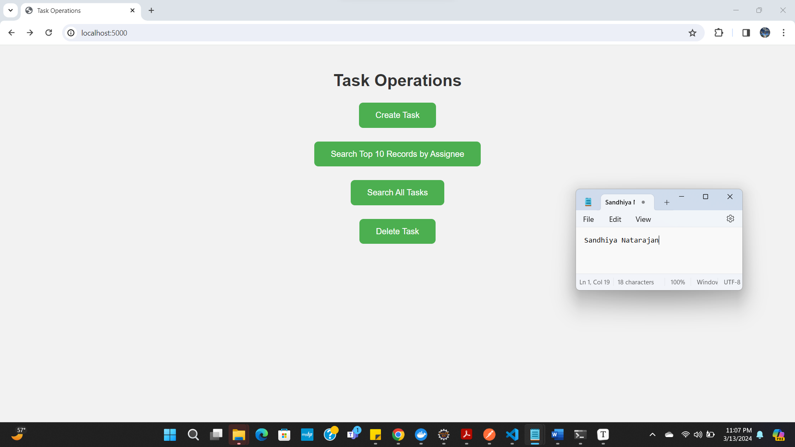

**Create Task**: Users can input task details in a form and submit it to create a new task record.


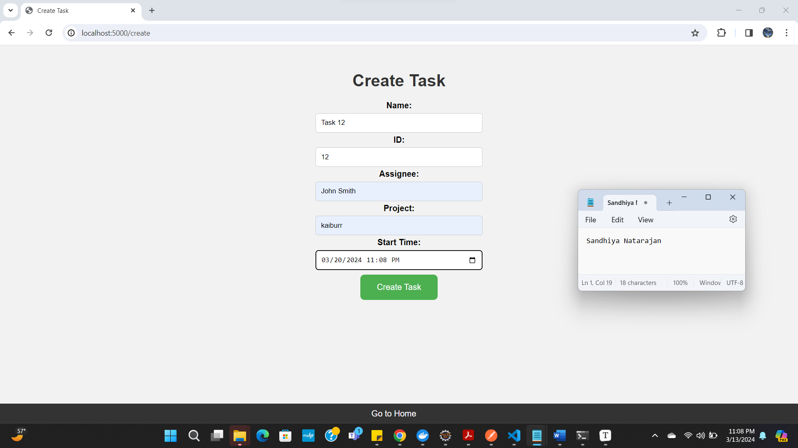

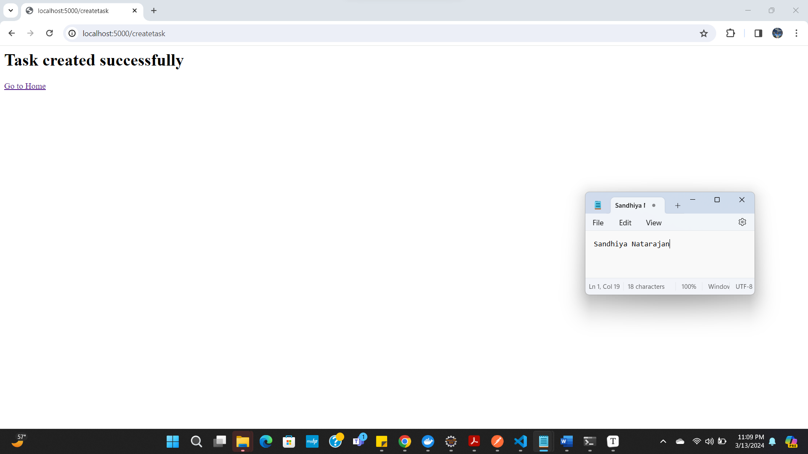

MongoDB

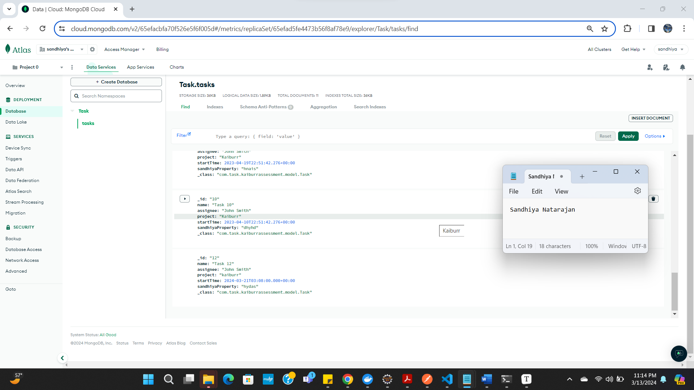

**Show Tasks by Assignee**: Display Top 10 tasks filtered by assignee.


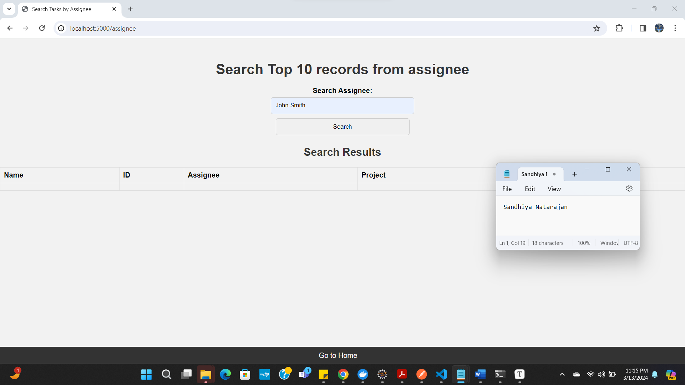

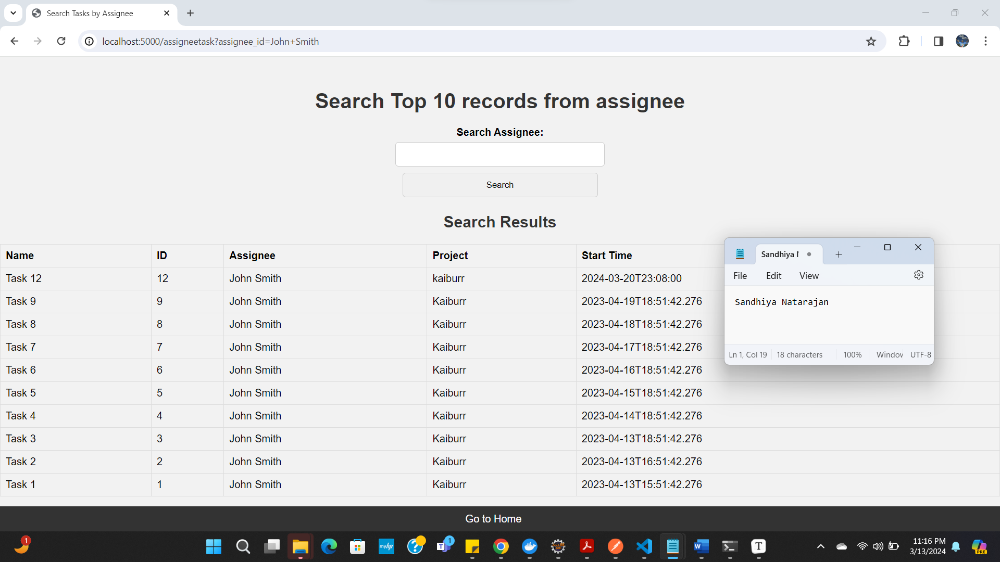

**Find All Tasks**:  Display all existing task records and allow searching by task ID.

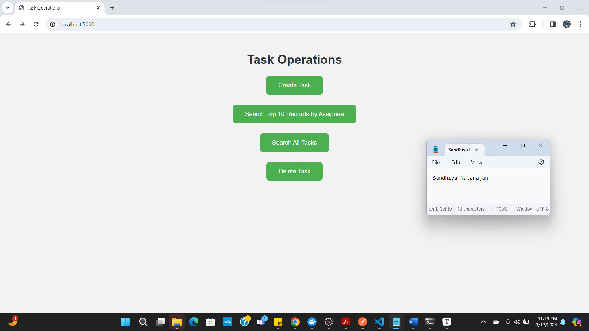

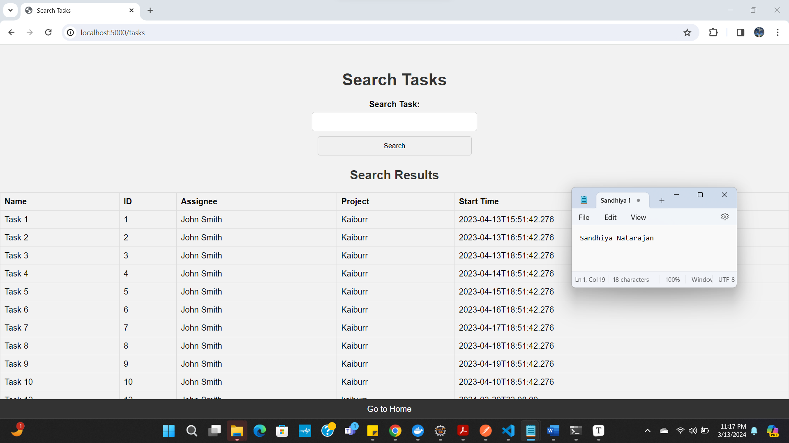

Search Tasks by ID

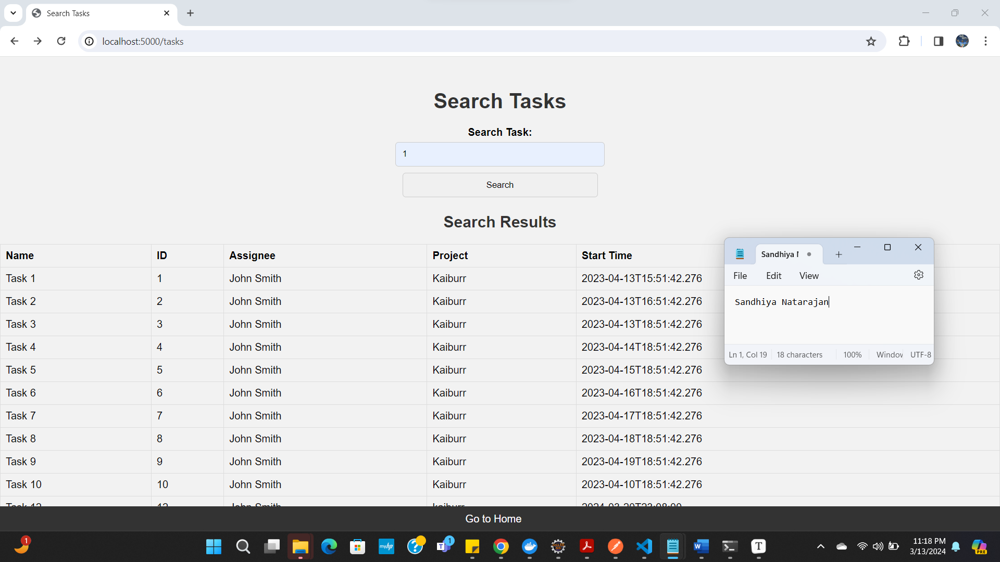

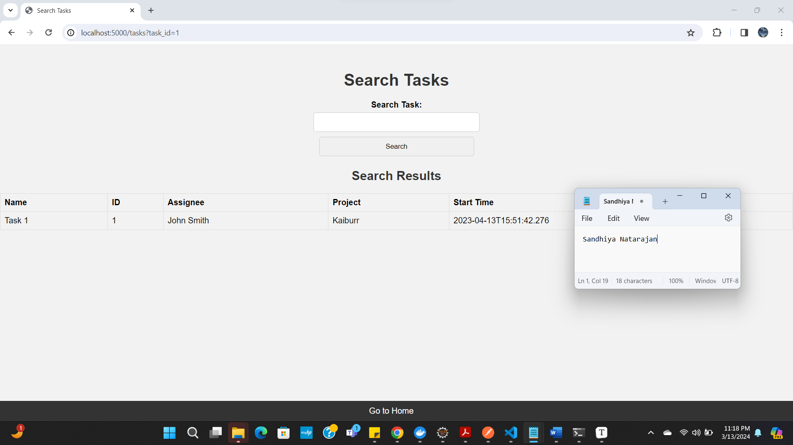

**Delete Task**: Users can select and delete task records by ID.


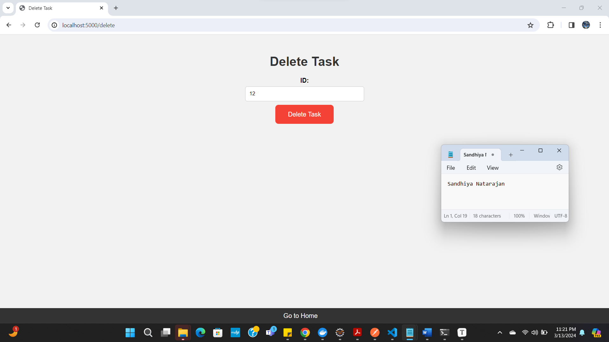


MongoDB

